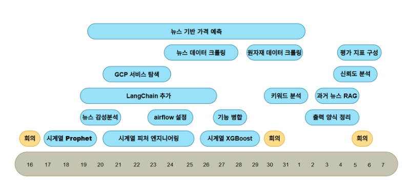
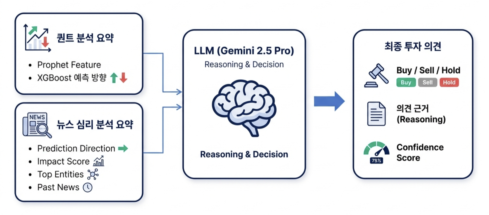

# 원자재 투자 결정 어시스턴트 프로젝트

네이버 부스트 캠프 AI-Tech 8기에서 진행한 NLP 도메인의 최종 프로젝트입니다.
- 기간 : 2026.01.16(금) - 2026.02.07(토)

## 👩‍🏫 프로젝트 소개
원자재 가격 변동에 대한 합리적인 설명을 사용자에게 보고서로 제공해주는 AI 어시스턴트로 시계열/뉴스 데이터를 종합해서 사용자가 시장에서 알고 싶은 정보를 제공합니다.

## 👨‍👦‍👦 팀 소개
### 팀 이름
파란 부스터 (NLP-09)


### 팀원 및 역할
| 이름 | 역할  |
| :-: | --- |
| **강다형** | GCP 환경 구성, 코드 리팩토링, 스크럼 운영 및 회의록 작성 |
| **김민석** | LangChain 구축, 뉴스 키워드 분석 및 과거 뉴스 RAG 기능 구현 |
| **김세훈** | 데이터 전처리, Airflow 자동화 파이프라인 및 서버 구축 |
| **박준범** | 모델과 에이전트 연결, 리포트 적재 파이프라인 구성 담당 |
| **이태원** | 시계열 데이터 기반 모델링(Prophet, XGBoost) 및 보고서 양식 정리 |
| **허승환** | 기사 데이터 기반 모델링(FinBERT) 및 앙상블 구조 설계 |

## ⚙ 환경
- Linux 기반 원격 GPU(V100 32GB) 서버 3개를 SSH 접속을 통해 활용
- GCP 서비스의 Vertex AI, Cloud Storage, Bigquery, Compute Engine 서비스 사용
- 협업 : Github, Notion, Slack

## 📆 타임 라인


## 📃 주요 구현 기능
### 서비스 아키텍처

- Airflow
    - 일 단위 원자재 시세와 시간 단위 뉴스 데이터를 수집·저장하고, 매일 지정된 시간에 보고서 생성
- LangChain
    - 4가지의 도구를 사용하는 Agent를 생성 (Gemini2.5 Pro 모델 사용)
- GCP
    - Vertex AI, BigQuery, Storage를 이용하여 데이터 호출 및 적재
    - Compute Engine을 이용하여 외부 서버 가동 후 Streamlit 구동하여 출력 결과물을 웹에서 볼 수 있게 시각화

### 시계열 데이터 분석 모델
- Prophet을 통해 피쳐 생성
	- 목표: 결과의 원인 설명이 가능한 XAI 구현을 위해 시계열 데이터의 직관적 분해 필요
	- 수행: Prophet을 활용하여 가격 데이터를 추세, 계절성, 변동성 등의 핵심 피쳐로 분해 및 생성
- XGBoost
	- 문제: Prophet 단독 사용 시 가격 등락 예측 정확도에 한계 확인
	- 해결: Prophet이 생성한 피쳐를 기반으로 '상승/하락' 이진 분류를 수행하는 XGBoost 모델 추가 도입
- 최종 예측
 - 배경: Prophet과 XGBoost 간 성능 차이가 미미하여 모델 선택의 모호성 발생
 - 최종 아키텍처: Prophet의 통계적 피쳐와 XGBoost의 예측 결과를 LLM에 동시 입력한 후 LLM이 수치적 데이터와 확률을 종합적으로 추론하여 최종 예측 방향을 결정
### 뉴스 데이터 분석 모델
- FinBERT를 이용하여 감성 데이터를 뽑아 초기 방향으로 제시
- Attention
	- 문장의 이해를 위해서 이용
	- threshold를 적용하여 작은 변동에 덜 민감하게 작용
- Ensemble
	- 모델의 쏠림 현상을 줄이기 위해 상승을 잘 맞추는 모델, 하락을 잘 맞추는 모델, 상승 하락 유지를 균등하게 보는 모델이 독립적으로 예측
	- 세 모델의 예측값과 신뢰도를 종합하여 최종 방향성(상승, 하락, 유지)을 결정
- 방향성과 유사한 감성을 가진 news와 반대 news 추출

### 키워드 추출 및 과거 뉴스 조회
- Pagerank 알고리즘을 이용하여 최상위 키워드 출
- 높은 점수를 받은 triple의 임베딩 과거 유사 뉴스 조회

### 최종 보고서 출력


### 랩업 리포트
- [랩업 리포트](asset/NLP-09_원자재_투자결정_어시스턴트.pdf)

## 시연 영상
[](https://www.youtube.com/watch?v=GadK78c9Bjg)

## 📁 파일 구조
```
📁 pro-nlp-finalproject-nlp-09/
├── 📁 WORKER_SERVER/
│   ├── 📁 airflow/
│   │   └── 📁 dags/
│   ├── 📁 crawler/
│   ├── 📁 processor/
│   │   └── 📁 bigquery/
├── 📁 app/
│   ├── 📁 config/
│   ├── 📁 model/
│   │   ├── 📁 news_sentiment_model/
│   │   │   └── 📁 trained_models_noPrice/
│   │   ├── 📁 timeseries_model/
│   │   └── 📁 models/
│   ├── 📁 routes/
│   ├── 📁 schema/
│   └── 📁 utils
├── 📁 docs/
├── 📁 finance_agent/
│   ├── 📁 pages/
│   ├── 📁 src/
│   ├── 🐍 app.py
├── 📁 libs/
│   ├── 📁 gcp/
│   │   ├── 📁 repositories/
│   │   └── 📁 sql/
│   ├── 📁 tests/
│   └── 📁 utils/
├── 📁 outputs/
├── 📁 scripts/
│   └── 📁 extract_opinion/
├── 📁 sql_references/
├── 📁 src/
├── ⚙️ .env_example
├── ⚙️ pyproject.toml
├── 🐍 run_pipeline.py
└── 🐍 streamlit.py
```
